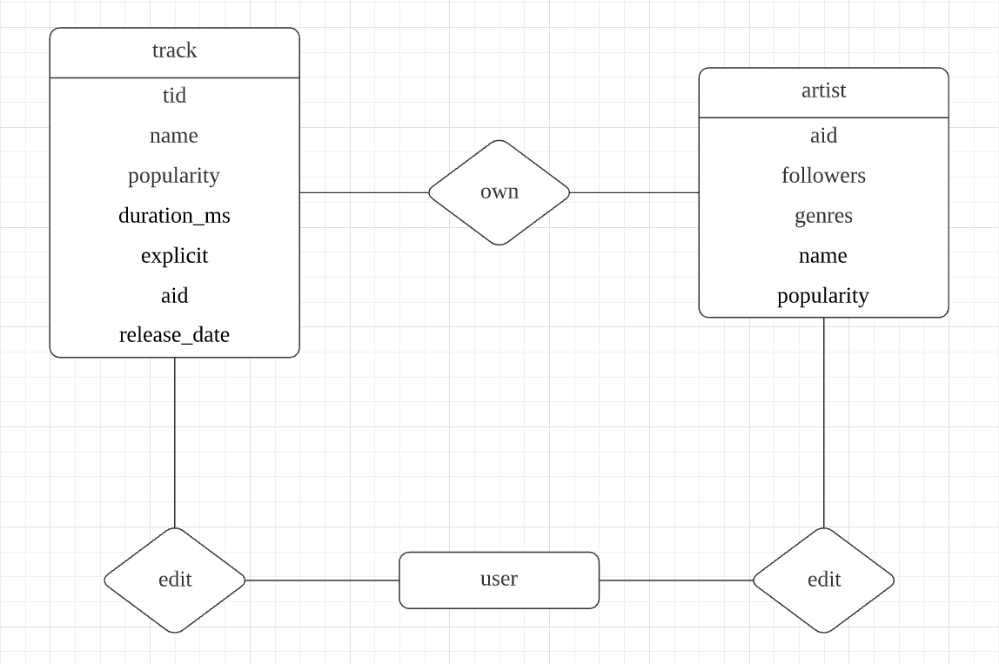

# xunyue-backend

Xunyue, a music-discovery app. This repository is a backend project for the
Database Application course, using **Springboot**, **MyBatis** and **MySQL**.
Front end's tech stack are listed under our front end repository
[xunyue-frontend](https://github.com/homanw104/xunyue-frontend).

Project demo: [xunyue.homans.world](https://xunyue.homans.world). If the
demo's dead, contact us for help :)

音乐是人们日常生活中不可或缺的重要元素，在娱乐方式多样化的今天，很多人通过听音乐来放松自己，
甚至通过音乐找到志同道合的朋友。在国内，市面上已经存在了非常多的音乐软件，但是不管是 QQ 音乐、
网易云音乐还是其他的音乐平台，它们提供的信息存在繁杂但不全面、准确度不高的问题。因此，我们希望
能通过汇集官方的音乐数据信息来为音乐发烧友提供一个准确而丰富的信息查询平台。


## Features

* 主界面，引导用户搜索
  
* 搜索结果界面，包括**有限个**热门度最高的歌曲和歌手，以及一个最热门的歌手或歌曲，
  点击其中任意一个可以进入详情页面
  
* 艺人详情，显示同一个艺人的所有歌曲
  
* 歌曲详情，显示歌曲详情与其它相关的歌曲

* 添加、修改、删除歌曲信息界面


## Database Design

### Entity Relationship Diagram



### Generating Primary Key

To avoid duplications in tracks and artists, a UUID (v4) is generated on
entity's creation as `id`. The UUID is encoded into base62 format and stored
as a 22-character long string in our database. The following dependency is
used for base62 encoding in our project.

```xml
<dependency>
    <groupId>me.ccampo</groupId>
    <artifactId>uuid62-core</artifactId>
    <version>0.1.1</version>
</dependency>
```

### DDL for artists

* `id`: 艺人 id，主键
* `name`: 艺人名字
* `followers`: 粉丝数
* `popularity`: 热门程度（范围 1 ~ 100）
* `genres`: 曲风（以字符串数组方式储存）

```sql
CREATE TABLE `artists` (
  `id` varchar(22) CHARACTER SET utf8mb4 COLLATE utf8mb4_0900_ai_ci NOT NULL,
  `name` varchar(255) DEFAULT NULL,
  `followers` int DEFAULT NULL,
  `popularity` int DEFAULT NULL,
  `genres` text,
  PRIMARY KEY (`id`),
  KEY `artists` (`name`)
) ENGINE=InnoDB DEFAULT CHARSET=utf8mb4 COLLATE=utf8mb4_0900_ai_ci
```

### DDL for tracks

* `id`: 歌曲 id，主键
* `name`: 歌曲名字
* `popularity`: 热门程度（范围 1 ~ 100）
* `duration_ms`: 歌曲长度（单位毫秒）
* `explicit`: 是否有暴露内容
* `artists`: 艺人名字（以字符串数组方式储存）
* `id_artists`: 艺人 id（以字符串数组方式储存）
* `release_date`: 发行日期（yyyy-MM-dd 或 yyyy）

```sql
CREATE TABLE `tracks` (
  `id` varchar(22) CHARACTER SET utf8mb4 COLLATE utf8mb4_0900_ai_ci NOT NULL,
  `name` text,
  `popularity` int DEFAULT NULL,
  `duration_ms` int DEFAULT NULL,
  `explicit` int DEFAULT NULL,
  `artists` text,
  `id_artists` text,
  `release_date` varchar(255) DEFAULT NULL,
  PRIMARY KEY (`id`),
  KEY `tracks` (`name`(255))
) ENGINE=InnoDB DEFAULT CHARSET=utf8mb4 COLLATE=utf8mb4_0900_ai_ci
```

### Data Sources

We use a public datasource containing more than 600k tracks and 1000k artists,
contributed by kaggle user [@yamaerenay](https://www.kaggle.com/yamaerenay),
licenced under Kaggle Community Data License Agreement.

Link to dataset:
[Spotify Dataset 1922-2021, ~600k Tracks](https://www.kaggle.com/yamaerenay/spotify-dataset-19212020-160k-tracks).

## Security Measures

### SSL Support

This project has enabled HTTPS support by adding a certificate issued for
`api.xunyue.homans.world` (valid in 90 days). The `TomcatConfig` class
will allow both HTTP port 9980 and HTTPS port 9900 to be used. You can
change those ports in `/src/main/resources/application.yml`.

### Encrypted Properties

Some properties in `application.yml` are encrypted and parsed by **Jasypt**.
To run this project, you need to add `-Djasypt.encryptor.password` parameter
in VM options for Jasypt to parse those secrets and start the application.

```shell
java -jar xxx.jar --jasypt.encryptor.password=masterPassword
```

Ask contributors for password, or replace those properties quoted with `ENC()`
with your own database and certificate configuration in `application.yml`.
You can you run the following command in project directory to encrypt your
own property string.

```shell
mvn jasypt:encrypt-value \
-Djasypt.encryptor.password="masterPassword" \
-Djasypt.plugin.value="theValueYouWantToEncrypt"
```

Reference: <https://github.com/ulisesbocchio/jasypt-spring-boot>

## Deployment Guide

我们的后端部署方式如下供参考。服务器环境：Ubuntu 20.04。
注：在大陆境内的服务器上部署需要 SSL 通信的服务可能要求报备。

### Prerequisites

* The server is recommended to have at least 512 MB of RAM to run a
  java application.
* Having a DNS A record points to the server.

### Deploying MySQL

Upgrade system:

```shell
sudo apt update && sudo apt upgrade
```

Install MySQL:

```shell
sudo apt install mysql-server mysql-client`
```

Modify MySQL configuration:

```shell
sudo nano /etc/mysql/mysql.conf.d/mysqld.cnf
```

Edit the corresponding lines into the following ones to allow access from WAN
and change default server port:

```shell
port 8809
```

```shell
# bind-address 127.0.0.1
```

Restart MySQL service:

```shell
sudo service mysql restart
```

### Install JDK 1.8

Download JDK 1.8 (you may find a mirror link for it):

```shell
`wget https://download.oracle.com/otn/java/jdk/8u271-b09/61ae65e088624f5aaa0b1d2d801acb16/jdk-8u271-linux-x64.tar.gz
```

Extract files:

```shell
sudo mkdir -p /usr/local/java
sudo tar -vzxf jdk-8u*-linux-x64.tar.gz -C /usr/local/java/
```

Add `JAVA_HOME` environment variable at the end of file: `sudo nano /etc/profile`

```shell
export JAVA_HOME=/usr/local/java/jdk1.8.0_271
export CLASSPATH=$CLASSPATH:$JAVA_HOME/lib/
export PATH=$PATH:$JAVA_HOME/bin
```

### Deploying the Backend Server

Run `package` target in Maven panel in your local IDE. The target file
`xunyue*.jar` should be in your `/target` directory. Upload it to the server
by whatever means.

On the server, create a folder for this project:

```shell
cd ~
mkdir xunyue-backend && cd xunyue-backend
```

Then create a script for starting your project: `nano start.sh`

```shell
#!/bin/bash
source /etc/profile;
nohup java -jar -Djasypt.encryptor.password=masterPassword xunyue*.jar &
```

Create another script for the stopping job: `nano stop.sh`

```shell
PID=$(ps -ef | grep xunyue*.jar | grep -v grep | awk '{ print $2 }')

if [ -z "$PID" ]
then
    echo PID not found. Application might have been stopped.
else
    echo kill $PID
    kill $PID
fi
```

Move your `*.jar` to the same directory as your scripts, run `./start.sh`
for starting the server and run `./stop.sh` for stopping it.

Now you are ready to work :)

## Team Members

* 杭海培：后端开发。
* 姜新宇：后端开发，数据库设计与文档撰写。
* 王皜民：前端开发，项目部署与文档撰写。
* 张式玉：后端开发。
* 张益嘉：前端开发。

该项目在通过存储在 GitHub 仓库来与组员进行协作， commit 记录完整地记录了我们的项目开发过程。

Link: <https://github.com/homanw104/xunyue-backend>


## Licence

This project is licenced under GPL-3.
